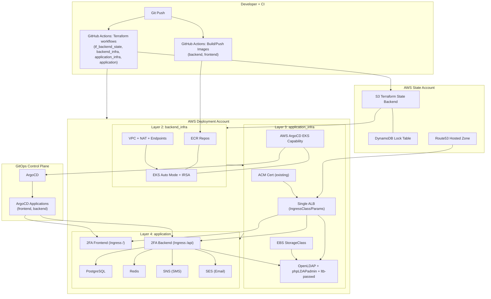
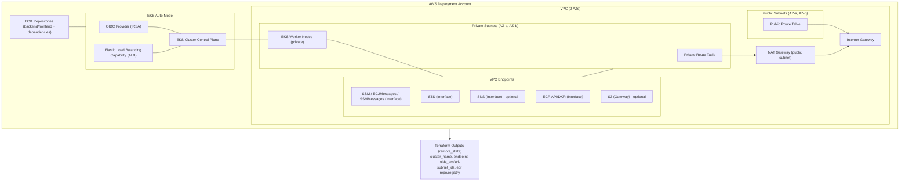
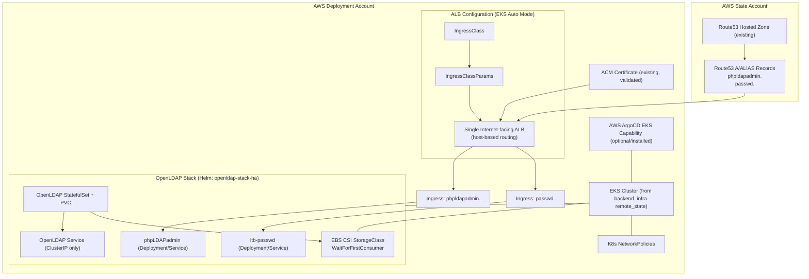
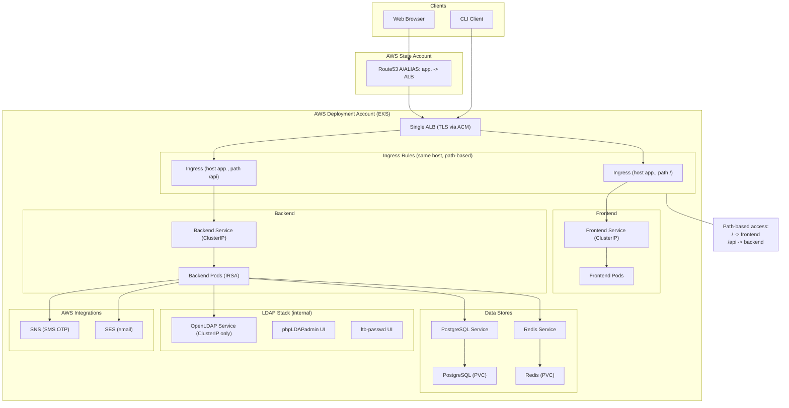

# Solution Architecture: LDAP 2FA on Kubernetes

This document describes the architecture of the ldap-2fa-on-k8s project from a
Solution Architect perspective. It covers the overall system, multi-account
design, each infrastructure and application layer, and how they integrate.

## Table of Contents

- [Executive Summary](#executive-summary)
- [High-Level Architecture](#high-level-architecture)
- [Multi-Account and Deployment Model](#multi-account-and-deployment-model)
- [Layer 1: Terraform State Backend](#layer-1-terraform-state-backend)
- [Layer 2: Backend Infrastructure](#layer-2-backend-infrastructure)
- [Layer 3: Application Infrastructure](#layer-3-application-infrastructure)
- [Layer 4: Application](#layer-4-application)
- [CI/CD and Operations](#cicd-and-operations)
- [Security and Compliance](#security-and-compliance)

## Executive Summary

The project delivers an **LDAP-based identity solution with two-factor
authentication (2FA)** on Amazon EKS. It provides:

- **Centralized identity**: OpenLDAP with high availability and multi-master
  replication, plus PhpLdapAdmin and LTB-passwd for administration and
  self-service password management.
- **2FA application**: A full-stack app (FastAPI backend, static frontend)
  with TOTP and SMS MFA, self-service registration, and admin workflows.
- **Infrastructure as Code**: Four Terraform layers (state backend, backend
  infra, application infra, application) with a strict deployment order.
- **GitOps**: ArgoCD (AWS EKS managed capability) for declarative deployment
  of the 2FA backend and frontend.
- **Multi-account AWS**: State and DNS in a State Account; compute, storage,
  and application resources in one or more Deployment Accounts.

The architecture is designed for security (IRSA, VPC endpoints, network
policies, TLS), operability (monitoring scripts, destroy flows, troubleshooting
docs), and clear separation between platform and application concerns.

## High-Level Architecture

The system is organized into four layers, deployed in sequence:

```text
+------------------------------------------------------------------+
|  Layer 1: Terraform State Backend (Account A)                    |
|  S3 bucket, versioning, encryption, file-based locking           |
+------------------------------------------------------------------+
                                    |
                                    v
+------------------------------------------------------------------+
|  Layer 2: Backend Infrastructure (Account B)                     |
|  VPC, EKS (Auto Mode), IRSA, VPC Endpoints, ECR                  |
+------------------------------------------------------------------+
                                    |
                                    v
+------------------------------------------------------------------+
|  Layer 3: Application Infrastructure (Account B)                 |
|  OpenLDAP stack, ALB, StorageClass, ArgoCD, Route53 records      |
+------------------------------------------------------------------+
                                    |
                                    v
+------------------------------------------------------------------+
|  Layer 4: Application (Account B)                                |
|  PostgreSQL, Redis, SES, SNS, ArgoCD Apps (2FA backend/frontend) |
+------------------------------------------------------------------+
```

- **Layer 1** provides remote Terraform state storage used by all other layers.
- **Layer 2** provides the Kubernetes platform (EKS), networking, and
  container registry.
- **Layer 3** provides the LDAP stack, ingress (ALB), persistent storage
  (StorageClass), and GitOps (ArgoCD).
- **Layer 4** provides the 2FA application and its dependencies (databases,
  caches, email/SMS).

Data flow at runtime:

- Users reach UIs (2FA app, PhpLdapAdmin, LTB-passwd) via HTTPS through a
  single ALB with host-based routing.
- The 2FA backend authenticates against LDAP (cluster-internal), uses
  PostgreSQL for registration/verification data, Redis for SMS OTP, and AWS
  SES/SNS (via IRSA) for email and SMS.



## Multi-Account and Deployment Model

| Resource Category              | Account A (State) | Account B (Deployment)   |
|--------------------------------|-------------------|--------------------------|
| Terraform state (S3)           | Yes               | No                       |
| Secrets (e.g. tf-vars)         | Yes               | No                       |
| Route53 hosted zone            | Yes               | No                       |
| Route53 records (ACM CNAMEs)   | Yes               | No                       |
| ACM certificate                | No                | Yes (per env/region)     |
| EKS, VPC, ALB, ECR             | No                | Yes                      |
| Application workloads          | No                | Yes                      |

- **Account A** holds shared, centrally managed assets: state, secrets, and DNS.
  Terraform uses Account A for backend state and for creating DNS (including
  ACM validation records).
- **Account B** holds infrastructure and applications. ACM lives in the
  deployment account so the ALB and certificate are in the same account.
  Dev and prod can use separate Deployment Accounts.

GitHub Actions (or local scripts) assume the State Account role for state and
Route53; the Terraform AWS provider then assumes a Deployment Account role
for creating resources in Account B. Cross-account assumption is protected by
ExternalId.

## Layer 1: Terraform State Backend

**Purpose**: Provide a remote, durable, and secure store for Terraform state
for all layers.

**Location**: `tf_backend_state/`

**Scope**:

- S3 bucket (name includes prefix and account ID for uniqueness).
- Versioning and server-side encryption (AES256).
- Block public access; IAM-based access (principal in bucket policy).
- File-based locking for state (no DynamoDB in this design).

**Consumers**: Every other Terraform root (backend_infra, application_infra,
application) configures an S3 backend pointing at this bucket, with
workspace-based state keys (e.g. `us-east-1-prod`).

**Deployment**: First layer to deploy. GitHub Actions use OIDC to assume the
State Account role; local runs use scripts that assume the same role (e.g.
from Secrets Manager). Outputs (e.g. bucket name) are written to GitHub
repository variables for use by other workflows.

## Layer 2: Backend Infrastructure

**Purpose**: Provide the Kubernetes platform and supporting AWS services
used by all application and application-infra components.

**Location**: `backend_infra/`

**Scope**:

- **VPC**: Public and private subnets across two AZs; NAT gateway; subnet
  tags for EKS (e.g. `kubernetes.io/role/elb`, `internal-elb`).
- **EKS**: Auto Mode cluster with IRSA (OIDC), managed node pool, and
  Elastic Load Balancing capability for ALB.
- **VPC Endpoints**: SSM (and related) for node management; STS for IRSA;
  optional SNS for SMS 2FA without internet.
- **ECR**: Private repository for container images (OpenLDAP, Redis,
  PostgreSQL, 2FA backend/frontend) with lifecycle policies.

**Outputs**: Cluster name, endpoint, OIDC provider ARN/URL, subnet IDs, ECR
registry/repository name. These are consumed by application_infra and
application via `terraform_remote_state`.

**Design notes**: Nodes run in private subnets. No EBS/StorageClass in this
layer; StorageClass is created in application_infra. Single NAT is a
cost/HA trade-off.



## Layer 3: Application Infrastructure

**Purpose**: Deploy the LDAP stack, ingress, persistent storage, and GitOps
on top of the EKS cluster from Layer 2.

**Location**: `application_infra/`

**Scope**:

- **Route53**: Uses an existing hosted zone (data source) in the State
  Account; does not create the zone.
- **ACM**: Uses an existing, validated public certificate in the Deployment
  Account (data source); DNS validation CNAMEs are created in the State
  Account.
- **StorageClass**: EBS CSI, WaitForFirstConsumer, used by OpenLDAP and
  by Layer 4 (PostgreSQL, Redis).
- **ALB**: IngressClass and IngressClassParams for EKS Auto Mode; a single
  internet-facing ALB is shared by host-based routing (phpldapadmin, passwd,
  app subdomains).
- **OpenLDAP**: Helm release (vendored openldap-stack-ha) with StatefulSet,
  PhpLdapAdmin and LTB-passwd; Ingresses for the UIs; LDAP remains
  cluster-internal (ClusterIP).
- **ArgoCD**: AWS EKS ArgoCD Capability (optional); used by Layer 4 for
  GitOps deployment of the 2FA apps.
- **Network policies**: Restrict pod-to-pod traffic (e.g. encrypted ports).
- **Route53 records**: A (alias) records for phpldapadmin and passwd
  pointing at the ALB (State Account provider).

**Dependencies**: Reads backend_infra remote state for ECR and cluster
information. Uses State Account provider for Route53 records.

**Design notes**: LDAP is not exposed to the internet. TLS is terminated at
the ALB (ACM). cert-manager module exists but is not in use; ACM is used
directly.



## Layer 4: Application

**Purpose**: Deploy the 2FA application and its data stores and integrations
(PostgreSQL, Redis, SES, SNS, ArgoCD Applications).

**Location**: `application/`

**Scope**:

- **PostgreSQL**: Bitnami Helm chart; user registration and verification
  token storage; uses StorageClass from application_infra; ECR image.
- **Redis**: Bitnami Helm chart; SMS OTP storage with TTL; uses same
  StorageClass; ECR image.
- **SES**: Email verification and notifications; IAM role and IRSA for the
  2FA backend service account.
- **SNS**: SMS 2FA; IAM role and IRSA for the backend; optional VPC
  endpoint in backend_infra.
- **ArgoCD Applications**: Two Application CRDs (backend, frontend)
  referencing Helm charts from the repo; same ALB and IngressClass as
  application_infra so the 2FA app is served on the same ALB (e.g.
  app.{domain}).
- **Route53**: A (alias) record for the 2FA app hostname in the State
  Account.
- **Admin seed**: Optional one-time Job to seed the first admin user in
  the 2FA app (LDAP-backed); uses LDAP/PostgreSQL outputs from
  application_infra.

**Dependencies**: Reads backend_infra state (ECR, cluster) and
application_infra state (StorageClass, ArgoCD namespace/project, ALB name
and IngressClass, LDAP connection details for admin-seed).

**Application stack**:

- **Backend**: Python FastAPI; LDAP auth; user registration and MFA
  (TOTP/SMS); admin API; uses PostgreSQL, Redis, SES, SNS via IRSA.
- **Frontend**: Static HTML/JS/CSS served by nginx; talks to backend API;
  deployed as a separate Helm chart and ArgoCD Application.

Containers are built and pushed by CI (e.g. GitHub Actions) to ECR before
Layer 4 apply; ArgoCD syncs the applications that reference those images.



## CI/CD and Operations

**Pipelines**: GitHub Actions workflows for:

- State backend: provision/destroy.
- Backend infra: provision/destroy.
- Application infra: provision/destroy.
- Application: provision/destroy.
- Backend and frontend: build and push images to ECR.

Deployment order is fixed: state backend first, then backend infra,
application infra, then application. Build workflows for backend and
frontend must run before application provisioning so ECR has images.

**Secrets and variables**: State Account role ARN, Deployment Account role
ARNs (prod/dev), ExternalId, and Terraform variables (e.g. passwords) are
stored in GitHub Secrets or AWS Secrets Manager. Repository variables hold
bucket name, ECR repository name, and similar non-sensitive values.

**Scripts**: Shared scripts (e.g. `assume-github-role.sh`, `get-eks-token.sh`,
`mirror-images-to-ecr.sh`, `set-k8s-env.sh`) support both CI and local runs.
Layer-specific scripts: `setup-*.sh` and `destroy-*.sh` for each Terraform
root; `monitor-deployments.sh` in backend_infra, application_infra, and
application for health checks and basic diagnostics.

**Documentation**: `docs/auxiliary/` contains guides (cross-account, SMS,
security), PRDs (OpenLDAP, ALB, 2FA app, signup, admin, SMS OTP), and a
troubleshooting index that links to deployment, LDAP, application layer,
DNS/certs, and secrets/state.

## Security and Compliance

- **Identity**: No long-lived AWS keys in workloads. GitHub uses OIDC to
  assume roles; pods use IRSA (OIDC + STS) for SES/SNS and other AWS APIs.
- **Network**: EKS nodes in private subnets; VPC endpoints for SSM, STS,
  and optionally SNS; network policies limit pod-to-pod traffic.
- **TLS**: HTTPS at the ALB with public ACM certificates; LDAP and
  backend traffic inside the cluster can use encrypted ports as enforced
  by network policies.
- **Secrets**: Passwords and sensitive Terraform variables in Secrets
  Manager or GitHub Secrets; not committed. Kubernetes secrets (e.g.
  LDAP, PostgreSQL) are created by Terraform/Helm from these sources.
- **Multi-account**: State and DNS isolated in State Account; deployment
  and data in Deployment Account(s); cross-account assumption guarded by
  ExternalId.
- **Images**: ECR as single source for container images (no direct Docker
  Hub pull from the cluster); images mirrored via scripts where required.

This architecture supports a clear separation of concerns, repeatable
deployments, and a security posture suitable for identity and 2FA
workloads.
