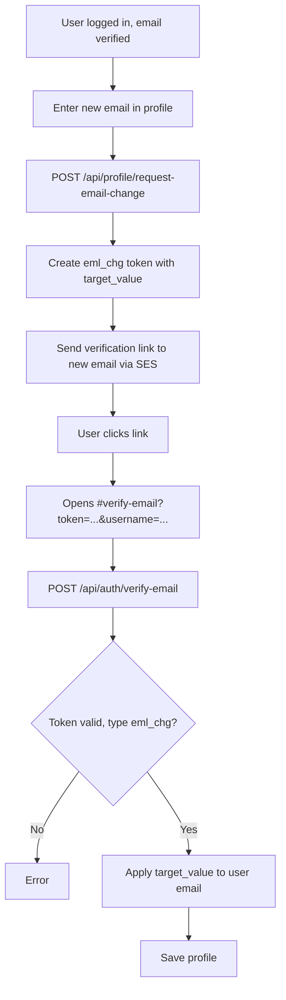
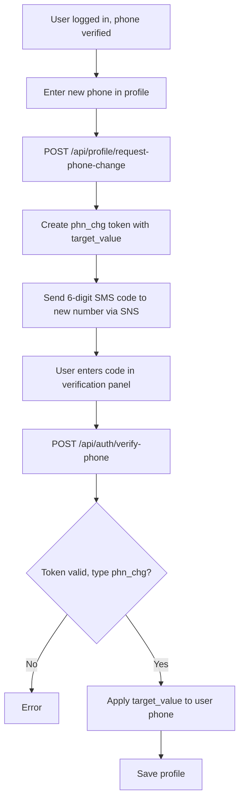
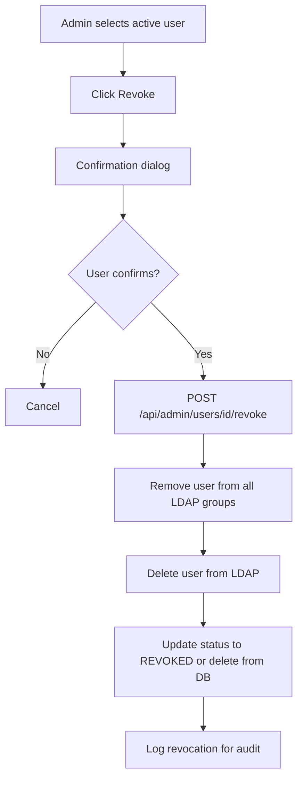

# PRD: Admin Functions and User Profile Management

## Overview

This document defines the requirements for admin functionality and user profile
management features in the LDAP 2FA Authentication application.

## Table of Contents

1. [User Profile Management](#1-user-profile-management)
   - [1.3 Profile and Admin Flow Diagrams](#13-profile-and-admin-flow-diagrams)
2. [SMS OTP Verification Requirements](#2-sms-otp-verification-requirements)
3. [Admin Dashboard](#3-admin-dashboard)
4. [Group Management](#4-group-management)
5. [User-Group Assignment](#5-user-group-assignment)
6. [Approve/Revoke Workflow](#6-approverevoke-workflow)
7. [List Features](#7-list-features)
8. [Admin Notifications](#8-admin-notifications)
9. [Top Navigation Bar](#9-top-navigation-bar)

## 1. User Profile Management

### 1.1 Profile Page

Users must be able to view and edit their profile details through a dedicated
profile page.

**Viewable Fields:**

- Username (read-only)
- First Name
- Last Name
- Email Address
- Phone Number (with country code)
- MFA Method(s) (list; user can have multiple methods: TOTP, SMS)
- Account Status
- Account Creation Date

**Editable Fields:**

| Field | Editable | Condition |
| ------- | ---------- | ----------- |
| Username | No | Never editable |
| First Name | Yes | Always |
| Last Name | Yes | Always |
| Email | Yes | Direct edit before verified; after verified, use request-email-change flow |
| Phone Number | Yes | Direct edit before verified; after verified, use request-phone-change flow |
| Password | Yes | Via change-password flow (current, new, confirm) |
| MFA Method | No | Must re-enroll to change |

### 1.2 Edit Restrictions and Change Flows

- **Email Address**: Before verification, can be edited directly. After verification,
  use `POST /api/profile/request-email-change` to request a change; backend sends
  verification link to the new email; user clicks link and `verify-email` applies
  the new address. Prevents account takeover.
- **Phone Number**: Before verification, can be edited directly. After verification,
  use `POST /api/profile/request-phone-change` to request a change; backend sends
  SMS code to the new number; user enters code and `verify-phone` applies the new
  number.
- **Password**: Authenticated users change password via
  `POST /api/profile/{username}/change-password` with `current_password`,
  `new_password`, and `confirm_password`. Updates both LDAP and PostgreSQL.

### 1.3 Profile and Admin Flow Diagrams

#### Profile Email Change Flow



#### Profile Phone Change Flow



#### Profile Password Change Flow

```mermaid
flowchart TD
    A[User logged in] --> B[Enter current password]
    B --> C[Enter new password + confirm]
    C --> D[POST /api/profile/{username}/change-password]
    D --> E{Current password correct?}
    E -->|No| F[Error: invalid current password]
    E -->|Yes| G{New and confirm match?}
    G -->|No| H[Error: passwords do not match]
    G -->|Yes| I[Update password in LDAP]
    I --> J[Update password_hash in PostgreSQL]
    J --> K[Success]
```

#### Admin User Revocation Flow



#### Admin Group Management Flow

```mermaid
flowchart TD
    subgraph Create
        A1[Admin enters group name + description] --> A2[POST /api/admin/groups]
        A2 --> A3[Create LDAP group]
        A3 --> A4[Create PostgreSQL record]
    end
    subgraph Read
        B1[GET /api/admin/groups] --> B2[List all groups]
        B2 --> B3[GET /api/admin/groups/id]
        B3 --> B4[View group details + members]
    end
    subgraph Update
        C1[Admin edits name/description] --> C2[PUT /api/admin/groups/id]
        C2 --> C3[Sync changes to LDAP]
    end
    subgraph Delete
        D1[Admin clicks Delete] --> D2[Confirmation required]
        D2 --> D3[DELETE /api/admin/groups/id]
        D3 --> D4[Remove from LDAP]
        D4 --> D5[Delete PostgreSQL record]
    end
```



#### Admin User-Group Assignment Flow

```mermaid
flowchart TD
    A[Admin selects user] --> B{Operation}
    B -->|Assign| C[POST /api/admin/users/id/groups]
    B -->|Replace| D[PUT /api/admin/users/id/groups]
    B -->|Remove| E[DELETE /api/admin/users/id/groups/group_id]
    C --> F[Add user to LDAP group(s)]
    F --> G[Create user_groups records]
    D --> H[Replace all memberships]
    H --> F
    E --> I[Remove from LDAP group]
    I --> J[Delete user_groups record]
```

## 2. SMS OTP Verification Requirements

### 2.1 Phone Verification Requirement

Users can only use SMS OTP as their MFA method if their phone number has been verified.

**Behavior:**

- MFA method selection occurs during login enrollment, not during signup
- Phone verification is completed during signup (before MFA enrollment)
- SMS OTP option is disabled/hidden for users with unverified phone numbers
- Login attempts with SMS MFA and unverified phone display error:
"Phone verification required for SMS authentication"

### 2.2 Implementation Rules

- During MFA enrollment: SMS option only available if `phone_verified = true`
- During login: If `mfa_method = 'sms'` and `phone_verified = false`,
reject with appropriate error
- UI should grey out or hide SMS option for unverified users

## 3. Admin Dashboard

### 3.1 Access Control

The Admin tab/section is only visible and accessible to users who are members of
the LDAP admin group.

**Visibility Rules:**

- Admin tab hidden for non-admin users
- Admin routes protected by admin authentication
- Admin status determined by LDAP admin group membership

### 3.2 Admin Dashboard Features

**User Management Section:**

- View all users in the system
- See user details:
  - Full name
  - Username
  - Email
  - Phone number
  - Account status (pending, complete, active, revoked)
  - Email verification status
  - Phone verification status
  - MFA method
  - Group memberships
  - Creation date
  - Activation date and activating admin (if applicable)

**Group Management Section:**

- View all groups
- Create new groups
- Edit existing groups
- Delete groups
- View group members

## 4. Group Management

### 4.1 Group CRUD Operations

Admins must have full CRUD (Create, Read, Update, Delete) capabilities for groups.

**Create Group:**

- Name (required, unique)
- Description (optional)
- Automatically creates corresponding LDAP group

**Read Groups:**

- List all groups with member counts
- View group details including all members

**Update Group:**

- Modify group name
- Modify group description
- Changes sync to LDAP

**Delete Group:**

- Remove group from system
- Remove all user associations
- Delete corresponding LDAP group
- Confirmation required before deletion

### 4.2 Group Data Model

```text
Group:
  - id: UUID (primary key)
  - name: string (unique)
  - description: string
  - ldap_dn: string (LDAP distinguished name)
  - created_at: timestamp
  - updated_at: timestamp
```

## 5. User-Group Assignment

### 5.1 Assignment Capabilities

Admins can manage user-group relationships with the following operations:

**Assign to Group(s):**

- Add user to one or more groups
- User can belong to multiple groups simultaneously
- Updates both database and LDAP group membership

**Remove from Group:**

- Remove user from a specific group
- User remains in other assigned groups

**Replace Groups:**

- Replace all user's group memberships with a new set
- Useful for role changes

### 5.2 User-Group Data Model

```text
UserGroup:
  - user_id: UUID (foreign key to users)
  - group_id: UUID (foreign key to groups)
  - assigned_at: timestamp
  - assigned_by: string (admin username)
```

## 6. Approve/Revoke Workflow

### 6.1 User Approval (Activate)

When an admin approves a user:

1. Admin selects user from "Awaiting Approval" list (status = 'complete')
    - Only users with status **COMPLETE** can be activated
    - Users in **PENDING** status cannot be activated (must complete verifications
    first)
2. Admin clicks "Approve" button
3. Modal appears with group selection (multi-select)
4. Admin selects one or more groups to assign (**required** - at least one group
must be selected)
5. On confirmation:
    - User is created in LDAP
    - User is added to selected LDAP group(s)
    - User status changes to 'active'
    - Welcome email is sent to user
    - Activation timestamp and admin recorded

> [!IMPORTANT]
>
> - **Group Assignment Requirement**: Group assignment is mandatory for activation.
> The backend validates that at least one group is provided and successfully assigned.
> Activation will fail if no groups are assigned.
> - **Status Requirements**: Only users with status **COMPLETE** (both email and
> phone verified) can be activated. Users in **PENDING** status must complete both
> verifications first, which automatically transitions them to **COMPLETE**.
> - **Post-Activation**: Once activated, users can log in and will be presented
> with MFA selection during their first login. Their access permissions are determined
> by their assigned group(s).

### 6.2 User Revocation

When an admin revokes an active user:

1. Admin selects active user
2. Admin clicks "Revoke" button
3. Confirmation dialog appears
4. On confirmation:
    - User is removed from all LDAP groups
    - User is deleted from LDAP
    - User status changes to 'revoked' OR user is deleted from database
    - Revocation is logged for audit

## 7. List Features

### 7.1 Requirements

All displayable lists (users, groups) must support:

**Sorting:**

- Click column header to sort ascending/descending
- Visual indicator for current sort column and direction
- Sortable columns for users: Name, Username, Email, Status, Created Date
- Sortable columns for groups: Name, Member Count, Created Date

**Filtering:**

- Users: Filter by status (pending, complete, active, revoked)
- Users: Filter by group membership
- Groups: Filter by member count range

**Searching:**

- Real-time search as user types
- Users: Search by username, email, first name, last name
- Groups: Search by name, description

### 7.2 UI Components

- Search input field with icon
- Filter dropdowns/buttons
- Sortable column headers with sort indicators
- Pagination for large lists (optional, based on data volume)

## 8. Admin Notifications

### 8.1 New User Signup Notification

When a new user signs up, all admin users receive an email notification.

**Trigger:** Successful user signup (after user record created)

**Recipients:** All users in the LDAP admin group (fetched via `mail` attribute)

**Email Content:**

- Subject: "New User Signup - [Username]"
- Body includes:
  - New user's username
  - Full name
  - Email address
  - Phone number
  - Signup timestamp
  - Direct link to admin dashboard for review

**Implementation:**

- Use existing AWS SES email infrastructure
- Query LDAP admin group for member emails
- Send notification asynchronously (don't block signup response)

## 9. Top Navigation Bar

### 9.1 Requirements

After successful login, the UI must display a persistent top navigation bar.

**Components:**

- Application logo/name (left side)
- User information (right side):
  - Display name or username
  - Dropdown menu

### 9.2 User Menu Items

**For Regular Users:**

- Profile - Navigate to profile page
- Logout - End session and return to login

**For Admin Users:**

- Profile - Navigate to profile page
- Admin Dashboard - Navigate to admin section
- User Management - Navigate to user list
- Group Management - Navigate to group list
- Logout - End session and return to login

### 9.3 Visual Design

- Fixed position at top of viewport
- Consistent across all authenticated pages
- Dropdown menu appears on click/hover
- Visual distinction for admin menu items

## Technical Requirements

### Authentication

- JWT-based session management
- Token includes user ID, username, is_admin flag
- Token expiry with refresh mechanism
- All authenticated endpoints validate JWT

### API Endpoints

**Profile:**

- `GET /api/profile/{username}` - Get profile (authenticated)
- `PUT /api/profile/{username}` - Update profile (authenticated, owner only)

**Admin - Groups:**

- `GET /api/admin/groups` - List groups
- `POST /api/admin/groups` - Create group
- `GET /api/admin/groups/{id}` - Get group details
- `PUT /api/admin/groups/{id}` - Update group
- `DELETE /api/admin/groups/{id}` - Delete group

**Admin - User Groups:**

- `GET /api/admin/users/{id}/groups` - Get user's groups
- `POST /api/admin/users/{id}/groups` - Assign groups
- `PUT /api/admin/users/{id}/groups` - Replace groups
- `DELETE /api/admin/users/{id}/groups/{group_id}` - Remove from group

**Admin - User Management:**

- `GET /api/admin/users` - List users (with sorting, filtering, search)
- `POST /api/admin/users/{id}/revoke` - Revoke user

### Security Considerations

- All admin endpoints require admin authentication
- Profile edits require owner authentication
- Email/phone changes only allowed before verification
- Rate limiting on admin operations
- Audit logging for admin actions

## Success Criteria

1. Users can view and edit their profile with appropriate restrictions
2. SMS OTP only available for users with verified phone numbers
3. Admin tab only visible to admin users
4. Admins can perform full CRUD on groups
5. Admins can assign/remove users from groups
6. Approval workflow requires group assignment
7. Revoke removes user from LDAP and groups
8. All lists support sorting, filtering, and searching
9. Admins receive email when new users sign up
10. Top bar displays logged-in user with functional menu
